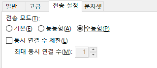

## 개요

퍼블릭클라우드 환경에서는 일반적인 21포트를 사용한 vsftp사용이 아래 이유로 어렵기때문에 공유차원으로 작성

FTP 액티브와 패시브의 차이점<br>
[https://extrememanual.net/3504](https://extrememanual.net/3504)

서버와 클라이언트의 통신을 풀어보면 중요한 점은 서버가 클라이언트의 해당 포트에 접속해 데이터를 보내준다는 것.
이런 구조때문에 클라이언트에서 방화벽에 해당 포트를 열어서 사용하거나 NAT 환경에 있는 네트워크라면 포트포워딩을 해줘야합니다.

## 처리방법

단순히 서버에서 vsftp설치 후 접근해보면 아래와 같은 오류를 확인할 수 있습니다.

`상태:	45.249.160.164:21에 연결...`<br>
`상태:	연결 수립, 환영 메시지를 기다림...`<br>
`응답:	220 (vsFTPd 3.0.2)`<br>
`명령:	AUTH TLS`<br>
`오류:	서버에 연결하지 못함`<br>

<br>
최소 두개의 포트가 필요하며, (default 21, 20)
/etc/vsftpd.conf 에 아래 명령을 추가해줍니다. 사용하지 않는 포트범위를 지정해줍니다.
수동형(pasv)접근을 허용하며, 기본포트는 10022로 설정하며 10022\~10030 사이의 포트를 사용합니다.

<span style="color:#000000">`listen_port=10022`</span><br>
`pasv_enable=YES`<span style="color:#000000"></span><br>
`pasv_min_port=10022`<br>
`pasv_max_port=10030`

서버 설정 후 파일질라 클라이언트의 사이트관리자에서 포트넘버와 수동형 접근을 체크 후 접속 확인을 해봅니다.


<span style="color:#171717">anonymous\_enable=NO</span>
anoymous접근은 차단!

<br>
<span style="color:#000000">**<span style="color:#000099"><span style="color:red">패시브</span> 모드를 사용하기 위한 proftpd.conf </span>**</span>

```
[root@smileserv ~]# vi /etc/proftpdproftpd.conf
# You may specify an explicit list of local users to chroot to their home
# directory. If chroot_local_user is YES, then this list becomes a list of
........................................................................................................................<br>
........................................................................................................................<br>
AllowForeignAddress on
# 30000 ~ 32000 Port 를 사용해서 패시브 포트 지정
PassivePorts 50000 50001
```