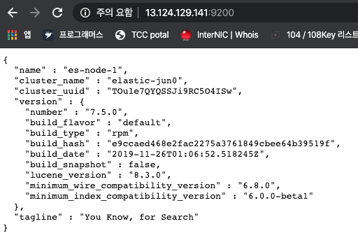
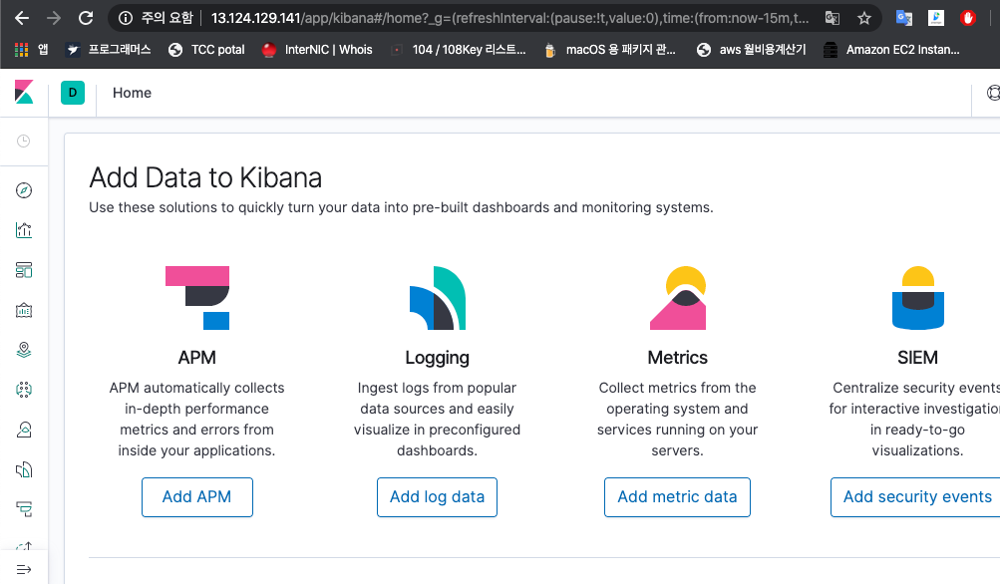

## 개요

Elasticsearch + kibana + logstash를 설치합니다.
설치 버전은 모두 7.5.0으로 동일합니다.

OS : amazn2-ami-hvm-2.0.20191217

## Elasticsearch

1\. Elasticsearch repo 생성

```
vim /etc/yum.repos.d/elasticsearch.repo
```

```
[elasticsearch-7.x]
name=Elasticsearch repository for 7.x packages
baseurl=https://artifacts.elastic.co/packages/7.x/yum
gpgcheck=1
gpgkey=https://artifacts.elastic.co/GPG-KEY-elasticsearch
enabled=1
autorefresh=1
type=rpm-md
```

`7.x 그대로 복사하여 붙혀넣어야지만 정상 동작합니다. 7.0.1과 같은 특정버전으로 변경시 fail이 발생합니다.`

2\. 설치

```
yum install elasticsearch-7.5.0
```

```
#==========================================================================================================================================
Package                            Arch                        Version                      Repository                              Size
==========================================================================================================================================
Installing:
elasticsearch                      x86_64                      7.5.0-1                     elasticsearch-7.x                      277 M

Transaction Summary
==========================================================================================================================================
Install  1 Package
```

`yum install elasticsearch로 설치하면 7.x 최신버전이 설치되므로 특정버전을 지정해줍니다.`

3.실행
<br>
```
service elasticsearch start
```

```
Starting elasticsearch (via systemctl):                    [  OK  ]
```
<br>
4\. 동작호출
<br>
```
curl -XGET 127.0.0.1:9200
```

```
{
  "name" : "es-node-1",
  "cluster_name" : "elastic-jun0",
  "cluster_uuid" : "TOu1e7QYQSSJi9RC5O4ISw",
  "version" : {
    "number" : "7.5.0",
    "build_flavor" : "default",
    "build_type" : "rpm",
    "build_hash" : "e9ccaed468e2fac2275a3761849cbee64b39519f",
    "build_date" : "2019-11-26T01:06:52.518245Z",
    "build_snapshot" : false,
    "lucene_version" : "8.3.0",
    "minimum_wire_compatibility_version" : "6.8.0",
    "minimum_index_compatibility_version" : "6.0.0-beta1"
  },
  "tagline" : "You Know, for Search"
}
```

**특이사항**
1. 만약 'curl: (7) : Failed connect to localhost:9200; 연결이 거부됨' 과 같은 Error가 발생할 경우, /etc/elasticsearch/elasticsearch.yml 파일에서 아래 설정을 확인합니다.<br>
`network.host: 127.0.0.1`

2. 웹에서 elasticsearch를 확인하고 싶으면 아래 설정을 추가해줍니다.<br>
`http.host: 0.0.0.0`


## Kibana

1\. repo
`elasticsearch의 repo로 yum install가능하여 별도 repo는 등록하지 않습니다.`

2\. 설치

```
yum install kibana-7.5.0
```
<br>
3.  yml 설정

```
vim /etc/kibana/kibana.yml
```

```
server.port: 5601
server.host: "0.0.0.0"
elasticsearch.hosts: ["[http://localhost:9200](http://localhost:9200)"]
```

`외부에서도 kibana 접근이 가능토록 host를 전체 개방합니다. 특정 IP에서만 확인할 경우 IP로 추가합니다.`

4\. 실행

```
service kibana start
```
<br>
5\. 웹 접근<br>

<br>
특이사항
kibana와 elasticsearch의 버전이 다를경우 <span style="color:#666666">`kibana server is not ready yet`에러가 발생할 수 있습니다.</span>
<br>
## logstash

**logstash의 경우 외부에서 받는 로그에 대해 별도 필터가 필요없을 경우 설치하지 않아도 무관합니다.**

1\. repo
`elasticsearch의 repo로 yum install가능하여 별도 repo는 등록하지 않습니다.`

2\. 설치

```
yum install logstash-7.5.0
```
<br>
3\. JAVA 설정
자바를 설치하여 사용해도 무관하나 elasticsearch에 jdk가 포함되어 있기때문에 해당 라이브러리를 bash에 참조합니다.

```
vim /etc/profile
```

```
export JAVA_HOME=/usr/share/elasticsearch/jdk
export PATH=$JAVA_HOME/bin:$PATH
export CLASSPATH="$JAVA_HOME/lib:$CLASS_PATH"
```

`yml 설정은 필요치 않습니다.`<br>
4\. 실행
logstash는 서비스 형태로 실행하는 것이 아닌 conf파일을 참조하여 실행합니다. 아래와 같은 명령으로 logstash를 실행할 수 있습니다.
보다 상세한 내용은 filebeat 연동에서 다루겠습니다.

```
/usr/share/logstash/bin/logstash -f /etc/logstash/conf.d/access_log.conf
```