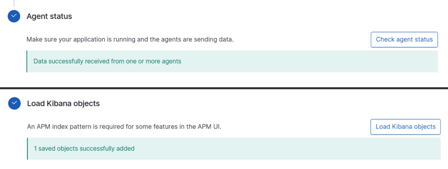
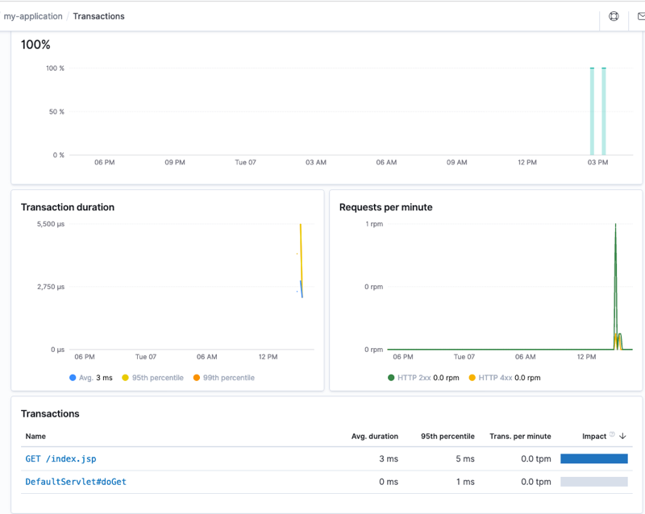

## 개요
* APM이란 : (Application Performance Monitoring)은 응용 프로그램 내부에서 심도있는 성능 메트릭과 오류를 수집합니다. 
  수천 개의 응용 프로그램의 성능을 실시간으로 모니터링 할 수 있습니다.
* APM-server 설치 이후 에이전트를 통한 톰캣9에대해 APM 모니터링을 진행합니다.
<br>

## APM 서버 설치
### APM 서버 설치(RPM)<br>
apm-server는 ELK와 통신이 가능한 서버에 설치하면 되나, 저의 경우 ELK와 동일한 인스턴스에 install 했습니다.
```shell
curl -L -O https://artifacts.elastic.co/downloads/apm-server/apm-server-7.5.0-x86_64.rpm
sudo rpm -vi apm-server-7.5.0-x86_64.rpm
```

### /etc/apm-server/apm-server.yml 수정
```yaml
apm-server:
  # Defines the host and port the server is listening on. Use "unix:/path/to.sock" to listen on a unix domain socket.
  host: "0.0.0.0:8200"
```

```yaml
output.elasticsearch:
    hosts: ["localhost:9200"]
    username: <username>
    password: <password>
```
### APM Server start
```shell
service apm-server start
```

## Tomcat 9 server set-up
### Agent install
```shell
wget https://repo1.maven.org/maven2/co/elastic/apm/elastic-apm-agent/1.12.0/elastic-apm-agent-1.12.0-javadoc.jar
```

### Tomcat9 설치<br>
(http://mirror.apache-kr.org/tomcat/tomcat-9/v9.0.30/bin/)<br>
Tomcat 9.0에는 Java 8 이상이 필요합니다.<br>
```shell
wget http://mirror.apache-kr.org/tomcat/tomcat-9/v9.0.30/bin/apache-tomcat-9.0.30.tar.gz
tar -xvf apache-tomcat-9.0.30.tar.gz
mv apache-tomcat-9.0.30.tar.gz /usr/local/tomcat9
```

### setenv.sh 스크립트생성<br>
catalina.sh 파일에는 자바 옵션 설정 및 톰캣 로그 경로등 각종 설정을 저장 할 수 있다.<br> 
기본파일을 변경할 경우 문제가 발생할 수 있기 때문에 추가 옵션을 설정하는 방법으로 bin/setenv.sh을 추가하여 사용하는 방법이 있다.

```shell
vim /usr/local/tomcat9/bin/setenv.sh
```
```
export CATALINA_OPTS="$CATALINA_OPTS -javaagent:/home/ec2-user/elastic-apm-agent-1.12.0.jar"
export CATALINA_OPTS="$CATALINA_OPTS -Delastic.apm.service_name=my-application"
export CATALINA_OPTS="$CATALINA_OPTS -Delastic.apm.application_packages=org.example,org.another.example"
export CATALINA_OPTS="$CATALINA_OPTS -Delastic.apm.server_urls=http://10.0.0.73:8200"
```
```shell
chmod +x setenv.sh
```

### 데몬재시작 프로세스 확인<br>
javaagent부터 `atalina_OPTS`를 올바르게 정의 했음을 확인 할 수 있다.
```
/usr/bin/java -Djava.util.logging.config.file=/usr/local/tomcat9/conf/logging.properties
-Djava.util.logging.manager=org.apache.juli.ClassLoaderLogManager -Djdk.tls.ephemeralDHKeySize=2048
-Djava.protocol.handler.pkgs=org.apache.catalina.webresources -Dorg.apache.catalina.security.SecurityListener.UMASK=0027
-javaagent:/home/ec2-user/elastic-apm-agent-1.12.0.jar -Delastic.apm.service_name=my-application
-Delastic.apm.application_packages=org.example,org.another.example 
-Delastic.apm.server_urls=http://10.0.0.73:8200 -Dignore.endorsed.dirs= 
-classpath /usr/local/tomcat9/bin/bootstrap.jar:/usr/local/tomcat9/bin/tomcat-juli.jar
-Dcatalina.base=/usr/local/tomcat9 -Dcatalina.home=/usr/local/tomcat9 
-Djava.io.tmpdir=/usr/local/tomcat9/temp org.apache.catalina.startup.Bootstrap start
```

Agent와 kibana 데이터 체크 가능합니다.


my-application명으로 트랜잭션,에러,JVM상태 확인 가능합니다.


## 참고자료
ELK설치 5편 (Application Performance Monitoring)<br>
http://www.gnoti.com/index.php/2018/10/12/elk5/ <br><br>
APM-agent설치<br>
https://repo1.maven.org/maven2/co/elastic/apm/elastic-apm-agent/1.12.0/<br><br>
JAVA jar파일 생성<br>
http://asuraiv.blogspot.com/2015/11/java-executableor-runnable-jar.html<br><br>
APM Java Agent 호출받기<br>
RPM으로 설치한 7버전 대 Tomcat은 동작하지 않아, rpm으로 9버전을 설치하여 테스트.<br>
```
https://www.elastic.co/guide/en/apm/agent/java/current/setup-javaagent.html#setup-generic
export CATALINA_OPTS="$CATALINA_OPTS -javaagent:/home/ec2-user/elastic-apm-agent-1.12.0.jar"
export CATALINA_OPTS="$CATALINA_OPTS -Delastic.apm.service_name=my-application"
export CATALINA_OPTS="$CATALINA_OPTS -Delastic.apm.application_packages=org.example,org.another.example"
export CATALINA_OPTS="$CATALINA_OPTS -Delastic.apm.server_urls=http://10.0.0.73:8200"
```
Tomcat 서버용 Elasticsearch에 APM 에이전트 설치<br>
https://curiousviral.com/installation-of-apm-agent-for-java/
