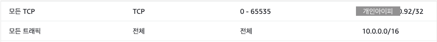
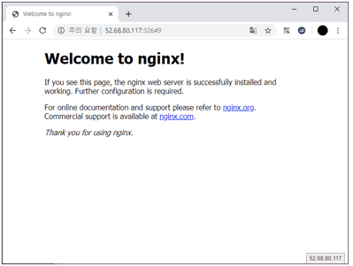
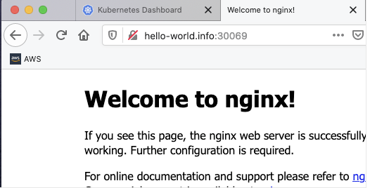

## 개요

* AWS에는 EKS로 불리는 쿠버네티스 서비스가 이미 존재합니다.
* EKS에 대해 알아보기 전 간단한 쿠버네티스 인스톨 및 노드 구성을 통해 동작에 대해 파악해봅니다.

- - -

* 사용 인스턴스
    * AWS EC2 : t3a.medium(2core,4ram) \* 2
    * OS : CentOS 7
* 용도
    * Master Node : 1
    * Worker Node : 1
* 보안그룹
    * 원활한 테스트를 위해 인스턴스간의 트래픽, 접속 클라이언트 PC의 IP에 대해 TCP 전체를 허용해줍니다.
    * 

## 본문

- 인스턴스 생성관련 내용은 생략합니다\.
- CB란에 &#91;root@ip\-10\-0\-0\-253 \~&#93;\# 와 같은 터미널 명령이 포함되어 있는 경우 확인에 관련한 내용이므로 반드시 수행하지 않으셔도 됩니다\.

### **[Mater,Worker 공통사항]**

1\. 인스턴스 생성 후 터미널 접근 후 아래 sh파일 실행

```shell
cat << EoF > ~/kube-preparation.sh
#!/bin/bash
# check id

ID=\`whoami\`

if [ \$ID != "root" ]
then
  echo "you must run as root"
  exit 1
fi

# swapoff

sed -i '/ swap / s/^\(.*\)$/#\1/g' /etc/fstab
swapoff -a

# disable selinux

setenforce 0
sed -i  s/SELINUX=enforcing/SELINUX=disabled/ /etc/selinux/config

# install utils

yum install -y epel-release
yum install -y vim wget

# install docker

yum install -y yum-utils device-mapper-persistent-data lvm2
yum-config-manager --add-repo https://download.docker.com/linux/centos/docker-ce.repo
yum install -y docker-ce docker-ce-cli containerd.io
systemctl enable docker && systemctl start docker

# change docker daemon driver from cgroupfs to systemd

cat <<EOF > /etc/docker/daemon.json
{
  "exec-opts": ["native.cgroupdriver=systemd"],
  "log-driver": "json-file",
  "log-opts": {
    "max-size": "100m"
  },
  "storage-driver": "overlay2"
}
EOF

mkdir -p /etc/systemd/system/docker.service.d
systemctl daemon-reload && systemctl restart docker

# edit kernel parameter

lsmod | grep br_netfilter
modprobe br_netfilter

cat << EOF >  /etc/sysctl.d/k8s.conf
net.bridge.bridge-nf-call-ip6tables = 1
net.bridge.bridge-nf-call-iptables = 1
EOF
sysctl --system

# install kube binary

cat << EOF > /etc/yum.repos.d/kubernetes.repo
[kubernetes]
name=Kubernetes
baseurl=https://packages.cloud.google.com/yum/repos/kubernetes-el7-x86_64
enabled=1
gpgcheck=1
repo_gpgcheck=1
gpgkey=https://packages.cloud.google.com/yum/doc/yum-key.gpg https://packages.cloud.google.com/yum/doc/rpm-package-key.gpg
EOF

yum install -y kubeadm kubelet kubectl
systemctl enable kubelet

echo "success"
exit 0

EoF
```

2\. Shell 수행

```shell
chmod +x ~/kube-preparation.sh
shell ~/kube-preparation.sh
```

- - -

### **[Master노드 구성]**

**1\. 마스터 노드 구성**

* pod-network-cidr 대역은 수정하지 않습니다.

```shell
kubeadm init --pod-network-cidr=10.244.0.0/16 --apiserver-advertise-address={ex)10.0.0.253}
```

<span style="color:#888888">1) 결과값</span>

* 마지막 줄 kubeadm 명령은 Worker노드에 입력이 필요하므로 복사해둡니다.

```
Your Kubernetes control-plane has initialized successfully!

To start using your cluster, you need to run the following as a regular user:

  mkdir -p $HOME/.kube
  sudo cp -i /etc/kubernetes/admin.conf $HOME/.kube/config
  sudo chown $(id -u):$(id -g) $HOME/.kube/config

You should now deploy a pod network to the cluster.
Run "kubectl apply -f [podnetwork].yaml" with one of the options listed at:
  https://kubernetes.io/docs/concepts/cluster-administration/addons/

Then you can join any number of worker nodes by running the following on each as root:

kubeadm join 10.0.0.253:6443 --token sdr4tf.rx09vg869oe2mw4t \
    --discovery-token-ca-cert-hash sha256:c2aa7a835dfe08870f2ead16051d287afcd1a4d5c3b1cdcd17dbbbe58ca9ef00
```

**2\. 정상노드 확인**

```shell
[root@ip-10-0-0-253 ~]# kubectl get node
NAME                                            STATUS   ROLES    AGE     VERSION
ip-10-0-0-253.ap-northeast-2.compute.internal   Ready    master   7m51s   v1.18.6
```

- - -

### <span style="color:#e11d21">**MasterNode 트러블 슈팅**</span>

<span style="color:#000000">**1\. 노드 노출불가**</span>

```shell
[root@ip-10-0-0-253 ~]# kubectl get nodes
The connection to the server localhost:8080 was refused - did you specify the right host or port?
```

```shell
[root@ip-10-0-0-253 ~]# mkdir -p $HOME/.kube
[root@ip-10-0-0-253 ~]# sudo cp -i /etc/kubernetes/admin.conf $HOME/.kube/config
[root@ip-10-0-0-253 ~]# sudo chown $(id -u):$(id -g) $HOME/.kube/config
[root@ip-10-0-0-253 ~]# kubectl get node
NAME                                            STATUS     ROLES    AGE   VERSION
ip-10-0-0-253.ap-northeast-2.compute.internal   NotReady   master   27s   v1.18.6
```

* STATUS NotReady는 2번 확인.

**2\. CNI 네트워크 에드온 Pending**

```shell
[root@ip-10-0-0-253 ~]# kubectl get pods --all-namespaces
NAMESPACE     NAME                                                                    READY   STATUS    RESTARTS   AGE
kube-system   coredns-66bff467f8-5chfb                                                0/1     Pending   0          2m5s
kube-system   coredns-66bff467f8-62lgx                                                0/1     Pending   0          2m5s
kube-system   etcd-ip-10-0-0-253.ap-northeast-2.compute.internal                      1/1     Running   0          2m22s
kube-system   kube-apiserver-ip-10-0-0-253.ap-northeast-2.compute.internal            1/1     Running   0          2m22s
kube-system   kube-controller-manager-ip-10-0-0-253.ap-northeast-2.compute.internal   1/1     Running   0          2m22s
kube-system   kube-proxy-mvmfx                                                        1/1     Running   0          2m6s
kube-system   kube-scheduler-ip-10-0-0-253.ap-northeast-2.compute.internal            1/1     Running   0          2m21s
```
<br>

```shell
kubectl apply -f https://raw.githubusercontent.com/coreos/flannel/master/Documentation/kube-flannel.yml
```

해결되지 않을경우 기존 flannel 삭제 후 calico 배포.

```shell
kubectl delete -f https://raw.githubusercontent.com/coreos/flannel/master/Documentation/kube-flannel.yml
kubectl apply -f https://docs.projectcalico.org/v3.11/manifests/calico.yaml
```

**3\. 정상 포드 확인**

```shell
[root@ip-10-0-0-253 ~]# kubectl get pods --all-namespaces
NAMESPACE     NAME                                                                    READY   STATUS    RESTARTS   AGE
kube-system   calico-kube-controllers-59877c7fb4-wzdtq                                1/1     Running   0          53s
kube-system   calico-node-77jw7                                                       1/1     Running   0          53s
kube-system   coredns-66bff467f8-5chfb                                                1/1     Running   0          7m26s
kube-system   coredns-66bff467f8-62lgx                                                1/1     Running   0          7m26s
kube-system   etcd-ip-10-0-0-253.ap-northeast-2.compute.internal                      1/1     Running   0          7m43s
kube-system   kube-apiserver-ip-10-0-0-253.ap-northeast-2.compute.internal            1/1     Running   0          7m43s
kube-system   kube-controller-manager-ip-10-0-0-253.ap-northeast-2.compute.internal   1/1     Running   0          7m43s
kube-system   kube-proxy-mvmfx                                                        1/1     Running   0          7m27s
kube-system   kube-scheduler-ip-10-0-0-253.ap-northeast-2.compute.internal            1/1     Running   0          7m42s
```

- - -

### **[Woker노드 구성]**

**1\. 워커 노드 구성\(마스터노드에 연결\)**

* [Mater,Worker 공통사항] 으로 환경 구성 후 Master 노드 구성으로 얻은 kubeadm 명령 값을 수행합니다.

```
kubeadm join 마스터노드아이피:6443 --token 마스터노드토큰 --discovery-token-ca-cert-hash "토큰검증을 위한 Root 인증서 해쉬값(마스터노드에서
확인 가능)"
```

예시)

```shell
kubeadm join 10.0.0.253:6443 --token sdr4tf.rx09vg869oe2mw4t \
    --discovery-token-ca-cert-hash sha256:c2aa7a835dfe08870f2ead16051d287afcd1a4d5c3b1cdcd17dbbbe58ca9ef00
```

**2\. 추가 이후 &#91;Master Node&#93;에서 get node로 추가 노드 확인**

* [Worker Node]에서는 kubectl명령이 동작하지 않는 것이 정상입니다.

```shell
[root@ip-10-0-0-253 ~]# kubectl get node
NAME                                            STATUS   ROLES    AGE   VERSION
ip-10-0-0-253.ap-northeast-2.compute.internal   Ready    master   24h   v1.18.6
ip-10-0-0-84.ap-northeast-2.compute.internal    Ready    <none>   23h   v1.18.6
```

* <span style="color:#e11d21">이후 모든 kubectl 명령은 Master Node에서만 수행합니다.</span>

- - -

### **[쿠버네티스 대시보드 배포]**

**1\. 웹 대시보드 배포**

```shell
kubectl apply -f https://raw.githubusercontent.com/kubernetes/dashboard/v2.0.0/aio/deploy/recommended.yaml
```

<span style="color:#888888">1) 배포 확인</span>

```shell
[root@ip-10-0-0-253 ~]# kubectl -n kubernetes-dashboard get service
NAME                        TYPE        CLUSTER-IP      EXTERNAL-IP   PORT(S)         AGE
dashboard-metrics-scraper   ClusterIP   10.100.86.114   <none>        8000/TCP        23h
kubernetes-dashboard        ClusterIP   10.105.129.70   <none>        443/TCP         23h
```

**2\. ClusterIP 변경**

* ClusterIP는 내부 접근만 가능하며 클라이언트 PC접근을 위해 NodePort로 변경

```shell
kubectl -n kubernetes-dashboard edit service kubernetes-dashboard
```

* type란에 대해 NodePort로 수정 후 저장

```yaml
spec:
  clusterIP: 10.105.129.70
  externalTrafficPolicy: Cluster
  ports:
  - nodePort: 31582
    port: 443
    protocol: TCP
    targetPort: 8443
  selector:
    k8s-app: kubernetes-dashboard
  sessionAffinity: None
  type: NodePort
status:
  loadBalancer: {}
```

* TYPE 변경과 사설 PORT 추가 확인

```shell
[root@ip-10-0-0-253 ~]# kubectl -n kubernetes-dashboard get service
NAME                        TYPE        CLUSTER-IP      EXTERNAL-IP   PORT(S)         AGE
dashboard-metrics-scraper   ClusterIP   10.100.86.114   <none>        8000/TCP        24h
kubernetes-dashboard        NodePort    10.105.129.70   <none>        443:31582/TCP   24h
```

**3\. 대시보드 관리자 계정 배포**

* 아래 명령 전체 복사 터미널 입력

```shell
cat << EOF > dashboard-admin.yaml

---
apiVersion: v1
kind: ServiceAccount
metadata:
  name: admin-user
  namespace: kube-system
---
apiVersion: rbac.authorization.k8s.io/v1beta1
kind: ClusterRoleBinding
metadata:
  name: admin-user
roleRef:
  apiGroup: rbac.authorization.k8s.io
  kind: ClusterRole
  name: cluster-admin
subjects:
- kind: ServiceAccount
  name: admin-user
  namespace: kube-system
EOF
```

* 배포

```shell
kubectl apply -f dashboard-admin.yaml
```

* 토큰값 확인

```shell
kubectl -n kube-system describe secret $(kubectl -n kube-system get secret | grep admin-user | awk '{print $1}')
```

* token값을 복사해둡니다. 토큰값이 길어 가이드에서는 일부 삭제했습니다.

```shell
[root@ip-10-0-0-253 ~]# kubectl -n kube-system describe secret $(kubectl -n kube-system get secret | grep admin-user | awk '{print $1}')
Data
====
ca.crt:     1025 bytes
namespace:  11 bytes
token:      eyJhbGciOiJSUzI1NiIsImtpZCI6ImRnTVl2Ri1Db3VQSEwtcURVdmNaX0k3eTk4bUNCeExUcmZwOWhtOXB0Y1EifQ.eyJpc3MiOiJrdWJlcm5ld
```

**4\. 대시보드 접근 확인**

* https://<대시보드포드를 실행 중인 워커노드의 아이피>:<전 단계에서 확인한 NodePort 값> 주소로 대시보드 접속한 뒤 위에서 확인한 토큰 값을 입력하여 대시보드 로그인
* http는 접속 불가가 정상입니다.
* 대시보드 기능 생략

****

- - -

### **[nginx-ingress 및 nginx-web 배포]**

* nginx-ingress : L7-로드밸런서 역할 외부트래픽을 nginx-web으로 포워딩
* nginx-web : 외부 공개 없이 ingress 백단에 위치한 웹

**1\. 2개의 nginx\-web 포드 배포**

* 배포 파일 작성

```shell
cat << EOF > run-my-nginx.yaml
---
apiVersion: apps/v1
kind: Deployment
metadata:
  name: my-nginx
spec:
  selector:
    matchLabels:
      run: my-nginx
  replicas: 2
  template:
    metadata:
      labels:
        run: my-nginx
    spec:
      containers:
      - name: my-nginx
        image: nginx
        ports:
        - containerPort: 80
EOF
```

* Pod 배포

```shell
kubectl apply -f ./run-my-nginx.yaml
```

* 포드 확인

```shell
[root@ip-10-0-0-253 ~]# kubectl get pods -l run=my-nginx
NAME                        READY   STATUS    RESTARTS   AGE
my-nginx-5dc4865748-c87j5   1/1     Running   0          3h30m
my-nginx-5dc4865748-vgqf5   1/1     Running   0          3h30m
```

**2\. Nginx 동작확인**

* expose 명령어를 통해 외부에서 접속이 가능하도록 포드 노출

```shell
kubectl expose deployment/my-nginx --type=NodePort
```

* 확인

```shell
[root@ip-10-0-0-253 ~]# kubectl get svc
NAME         TYPE        CLUSTER-IP     EXTERNAL-IP   PORT(S)        AGE
kubernetes   ClusterIP   10.96.0.1      <none>        443/TCP        25h
my-nginx     NodePort    10.97.235.46   <none>        80:30436/TCP   3h31m
```

* 클라이언트 PC에서의 확인은 http://<워커노드의 아이피주소>:\<NodePort> 를 통해 접속 테스트


**3\. Nginx ingress 배포**

* git이 없다면 `yum install git -y` 로 인스톨 및 ingress사용에 필요한 배포 생성

```shell
git clone [https://github.com/nginxinc/kubernetes-ingress/](https://github.com/nginxinc/kubernetes-ingress/)cd kubernetes-ingress/deployments
git checkout v1.7.

kubectl apply -f common/ns-and-sa.yaml
kubectl apply -f rbac/rbac.yaml
kubectl apply -f common/default-server-secret.yaml
kubectl apply -f common/nginx-config.yaml
kubectl apply -f common/vs-definition.yaml
kubectl apply -f common/vsr-definition.yaml
kubectl apply -f common/ts-definition.yaml
kubectl apply -f common/gc-definition.yaml
kubectl apply -f common/global-configuration.yaml
kubectl apply -f deployment/nginx-ingress.yaml
kubectl apply -f daemon-set/nginx-ingress.yaml
kubectl create -f service/nodeport.yaml
```

* nginx-ingress 생성 확인

```shell
[root@ip-10-0-0-253 ~]# kubectl get pods --namespace=nginx-ingress
NAME                           READY   STATUS    RESTARTS   AGE
nginx-ingress-7f659f75-rqfnq   1/1     Running   0          6h29m
nginx-ingress-hbm2z            1/1     Running   0          6h29m
```

* ingress 오브젝트 생성

```shell
cat << EOF > ingress.yaml
apiVersion: extensions/v1beta1
kind: Ingress
metadata:
  name: example-ingress
  annotations:
    ingress.kubernetes.io/rewrite-target: /
spec:
  rules:
  - host: hello-world.info
    http:
      paths:
        - path: /
          backend:
            serviceName: my-nginx
            servicePort: 80
EOF
```

* 배포

```shell
kubectl apply -f ./ingress.yaml
```

* 상태확인
    * Host의 도메인은 클라이언트 PC의 /etc/hosts파일을 수정하여 접근확인합니다.

```shell
[root@ip-10-0-0-253 ~]# kubectl describe ingress example-ingress
Name:             example-ingress
Namespace:        default
Address:
Default backend:  default-http-backend:80 (<error: endpoints "default-http-backend" not found>)
Rules:
  Host              Path  Backends
  ----              ----  --------
  hello-world.info
                    /   my-nginx:80 (192.168.200.16:80,192.168.200.17:80)
Annotations:        ingress.kubernetes.io/rewrite-target: /
Events:             <none>
```

* ingress 확인

```shell
[root@ip-10-0-0-253 ~]# kubectl get svc -n nginx-ingress
NAME            TYPE       CLUSTER-IP      EXTERNAL-IP   PORT(S)                      AGE
nginx-ingress   NodePort   10.111.227.54   <none>        80:30069/TCP,443:32135/TCP   6h37m
```

* 아래와 같이 확인가능하며, ingress로 접근하면 구성해놓은 2개의 pod로 분산되며, 라운드로빈형태로 접속이 됩니다.


* 추가로 별도의 파일을 만들어 컨테이너에 추가한뒤 호스트를 구분할 수 있지만 이 프로젝트에서는 다루지 않겠습니다.